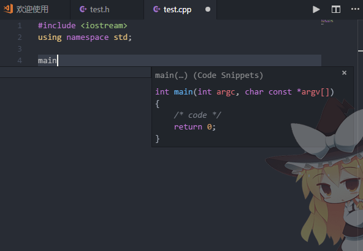
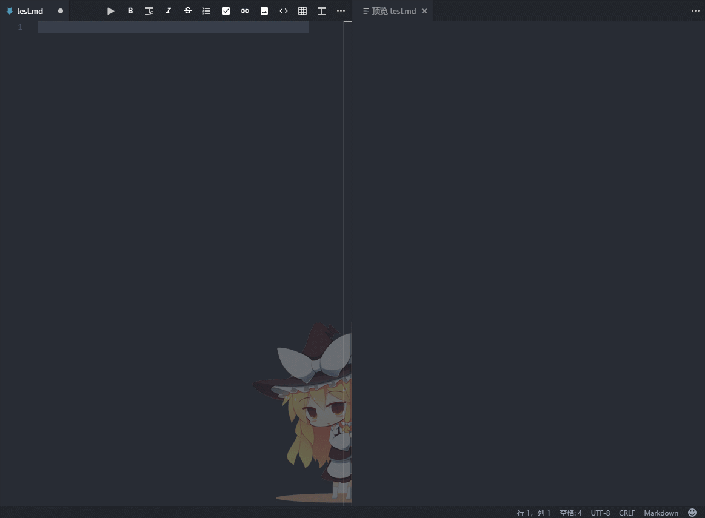
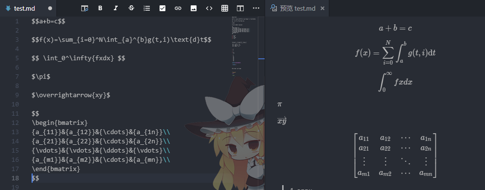

# Code Snippet
Insert file, or function in the comments section(Support C/Cpp,lua..etc ), as well as some snippet of language code.(Only support C/Cpp)

Enhanced VSCode markdown function, support task list, tables insert and format, the shortcut menu, shortcut keys, and navigation function buttons, special joined the word prompt functions, convenient in the markdown fast input.

Part of the code from github：[Markdown All in One](https://github.com/neilsustc/vscode-markdown), Markdown shortcut

在文件头部或函数部分插入注释, 以及快速输入一些语言的代码片段。特别的会更具代码种类调整注释保证注释在当前语言下合法, 代码片段目前只支持(c/cpp)

增强了VSCode的markdown功能，支持task list、表格的插入与格式化、快捷菜单、快捷按键、以及导航栏功能按钮，特别的加入了单词提示功能，方便在markdown中快速输入

markdown部分功能代码来自  [Markdown All in One](https://github.com/neilsustc/vscode-markdown), Markdown shortcut

## Example

1. fileheader
```
/********************************************************
 * @Copyright © blog: http://xxx.com
 * @Author: Coder
 * @Date:   2017-11-03 07:19:26 星期五
 * @File:   test.cpp
 * @Description:
********************************************************/
```

2. funcheader
```
/***
    @desc
    @author: Coder
    time:2017-11-03 07:19:42 星期五
    @param:
    @return:
***/
```

you can open vscode `setting` change the `Copyright` and `Author` info replace default setting

```
// CopyRight Info in header snipets
"codeSnippets.extension.copyRight": "blog: http://xxx.com",

//Author Info in block comment snipets
"codeSnippets.extension.author": "Coder"
```

3. snippet



1. markdown extension



5. laTex of MathJax 



I have try my best let it more useful, more functions wait for you find it.


## Install (see on [github](https://github.com/zhangyxXyz/Code-Snippet))

dowload or clone the repository from github, choose the file codesnippets.vsix to install.

## Uninstall
There are 2 options to uninstall the extention
1. via VSCode UI
    * open `Extensions` tab in the VS Code sidebar
    * hit "Uninstall" next to **Code Snippet** item.

2. via system command line
    * in your terminal run the following command
        `code --uninstall-extension codesnippets`

## Configure shortcuts
1. Insert the file Snippet Code Default shortcut is `ctrl + k, ctrl + h`

2. Insert the func Snippet Code Default shortcut is `ctrl + k, ctrl + f`

in your `Code/User/keybindings.json` file add the following:
```
{
    "command": "insertfileheader.perform",
    "key": "ctrl+k ctrl+h",
    "mac": "cmd+k cmd+h",
    "when": "editorTextFocus && !suggestWidgetVisible"
},
{
    "command": "insertfuncheader.perform",
    "key": "ctrl+k ctrl+f",
    "mac": "cmd+k cmd+f",
    "when": "editorTextFocus && !suggestWidgetVisible"
},
{
    "command": "markdown.extension.toggleHeadingUp",
    "key": "ctrl+shift+]",
    "mac": "cmd+shift+]",
    "when": "editorTextFocus && editorLangId == markdown && !suggestWidgetVisible"
},
{
    "command": "markdown.extension.toggleHeadingDown",
    "key": "ctrl+shift+[",
    "mac": "cmd+shift+[",
    "when": "editorTextFocus && editorLangId == markdown && !suggestWidgetVisible"
},
{
    "command": "markdown.extension.showCommandPalette",
    "key": "alt+shift+m",
    "when": "editorTextFocus && editorLangId == 'markdown'"
},
{
    "command": "markdown.extension.toggleBold",
    "key": "ctrl+b",
    "when": "editorTextFocus && editorLangId == 'markdown'"
}
.....
```

you can change it at keybindings.

## Update Log

### 0.06
1. Add Latex of MathJax
2. Add Systax Decorations
3. Auto fix ordered list markers

### 0.05
1. Remove extra dependencies

### 0.04
1. Adjustment function annotation format
2. Add a commond to insert time stamp

### 0.03
1. Fix the bug: checkbox unable

### 0.0.2

1. Enhanced VSCode markdown function.
2. Support task list
3. Tables insert and format
4. The shortcut menu, shortcut keys, and navigation function buttons
5. Special joined the word prompt functions, convenient in the markdown fast input.

### 0.0.1

1. Insert file, or function in the comments section(Support C/Cpp,lua..etc )
2. Snippet of language code.(Only support C/Cpp)


## Author
[Yunxing Zhang](http://www.onlyzyx.com/)

## Thanks
To [Nick Roach](https://www.elegantthemes.com/) for the great icon.

[Markdown All in One](https://github.com/neilsustc/vscode-markdown) for some markdown code.